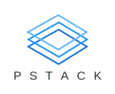
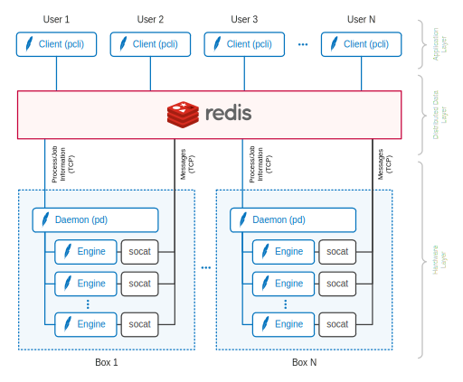

## POETS Simulation Stack (`pstack`)

	

### Overview

`pstack` is a spec-compliant distributed [POETS](https://poets-project.org)
simulation stack that uses [Redis](http://redis.io/) as an orchestration
layer. It exposes the compute power of a hetrogeneous array of POETS back-end
engines to multiple users in a POSIX-like environment.

Features:

- **Processes**: application instances modeled after POSIX processes
- **Multi-user support**: multiple users can run processes on a single `pstack` service simultaneously
- **Distributed execution**: a single application can be distributed across several machines in arbitrary arrangements
- **Real-time Monitoring**: live monitor of running processes and back-end engine resource utilisation
- **Heterogeneity**: supports arbitrary back-end engines (e.g. different simulators or even actual hardware)
- **Job queues**: processes are queued when back end engines are unavailable or insufficient
- **Terminal**: command line user interface with built-in Python interpreter
- **Debugging**: supports debug breakpoints and manual inspection/injection of messages
- **Unit Testing**: Down-to-earth [unit testing framework](tests) supporting push-button testing over entire back-end infrastructure
- **Minimal dependencies**: just [pip](https://pip.pypa.io/en/stable/installing/) and [socat](https://www.howtoinstall.co/en/ubuntu/xenial/socat) on a fresh Ubuntu installation.
- **Automated Deployment**: parallel (multi-host) installation over SSH in 10 seconds using [fabric](https://www.fabfile.org/).

Design Goals:

- Focus on developing POETS-specific capabilities while leaving more common
programming chores to existing specialized tools and technologies
([Redis](http://redis.io/) for distributed shared memory and
[socat](https://linux.die.net/man/1/socat) for socket communication).
- Decouple the hardware, orchestration and application layers using TCP
connections to permit reliable, performant and secure distributed deployment
using standard communication technologies (Ethernet, SSH tunnels etc.).
- Leverage Python for productivity
([multiprocessing](https://docs.python.org/2/library/multiprocessing.html),
[jinja](http://jinja.pocoo.org/docs/2.10/)) and C for performance
([simulation](templates))
- Deliver the best performance and feature set while keeping the
implementation as simple and maintainable as possible.

### Organization

The stack consists of hardware, orchestration and application layers as shown
below.

	

The main components are:

#### 1. POETS Engines

Engines are arbitrary software/hardware components capable of simulating POETS
devices as specified in the
[`graph-schema`](https://github.com/POETSII/graph_schema) spec and conforming
to an additional (simple and minimal) protocol to govern their communication
with the Redis orchestration layer. `pstack` ships with an stand-alone POETS
simulator `psim` that doubles as a compliant engine.

#### 2. POETS Daemon ([`pd`](pd.py))

This is a persistent background process that monitors the job queue on the
Redis orchestration layer and spawns engines to execute accepted jobs. It
handles all aspects of job and process control (e.g. queueing, status
reporting and logging).

#### 3. POETS Client ([`pcli`](pcli.py))

A super-charged Python terminal (syntax-coloring, auto-completion and
persistent context) that serves as an entry point for users into a `pstack`
service. It allows users to:

- Connect to the orchestration layer of a `pstack` deployment
- Start a process by loading a POETS XML file from their machines
- List and control running processes (through equivalent implementations of `ps` and `kill`)
- Monitor processes and back-end infrastructure in real time (through an equivalent implementation of `top`)
- Divide application devices into multiple subsets (called "regions") and map these to different engines

### Programming with `pstack`

While `pstack` is essentially a tool to _run_ POETS applications, it is also
very useful as an application development tool. The stack plays nice with
existing tools developed at Newcastle and introduces new concepts that makes
it useful to develop, debug and profile POETS applications.

#### 1. Application Engines

`pstack` is back-end agnostic and can run POETS applications on top of
anything that can compute the state of POETS devices, usually a
high-performance simulator such as [`psim`](psim.py) or actual POETS hardware.
Through [`pcli`](pcli.py), however, the user can also load and use lightweight
programmatic application-specific engines that they developed. These, like all
other engines, would be tasked with simulating a subset of devices in the
user's application. However, they differ from conventional engines in two
important aspects:

1. They run locally on the user's machine (specifically within `pcli`), and
2. They are developed in a high-level language, namely Python! :tada:

Applications engines may be slower than dedicated general-purpose engines but
they permit powerful manipulations of POETS processes with several end goals
in mind:

- **Flexible IO**: they can implement various high-level interfaces to feed
data in and out of a POETS process from
[files](http://docs.python-requests.org/en/master/),
[databases](https://postgres-py.readthedocs.io/en/latest/), [web
services](http://docs.python-requests.org/en/master/) and all sorts of other
channels.

- **Debugging Breakpoints**: they can suspend the execution of a POETS process
when certain conditions are met, allowing users to inspect local message
buffers and debug problematic execution scenarios.

- **Instrumentation**: they make it very easy to log events of interest and
profile applications.

- **Productivity**: they make it possible to leverage high-level programming
productivity to prototype POETS applications. Application engines allow
messages to be consumed and generated by user-supplied Python functions,
giving users the full power of the entire Python ecosystem.

For a real-life example of an application engine in use see
[`example-engine.py`](example-engine.py).

---

This documentation is a work in progress. More sections will be added soon.
