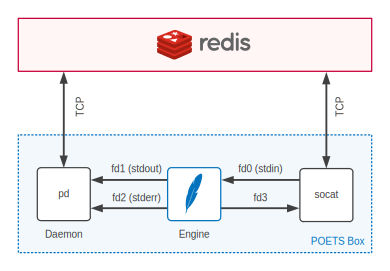
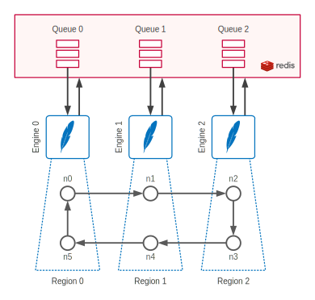

## Developing `pstack` Engines

### Content

- [What is an Engine?](#what-is-an-engine)
- [How does an Engine Work?](#how-does-an-engine-work)
- [Distributed Simulations](#distributed-simulations)
	- [Simulation Regions](#simulation-regions)
	- [Engine Communication](#engine-communication)
- [The Specification](#the-specification)
	- [Engine Launch](#engine-launch)
	- [Stream Protocols](#stream-protocols)

### What is an Engine?

Engines are the bottom layer of `pstack` and are responsible for computing
device states and consuming/generating messages. This document describes the
`pstack` engine specification.

The diagram below is a more refined view of the organization diagram in
[README](../readme.md), showing how engines communicate with their surrounding
components in `pstack`.

<p align="center">
	
</p>

This may appear somewhat complicated by it's not. Well, here are the good news
for a start:

1. Engines communicate with their environment through input and output
streams. Even though they're building blocks for a distributed computing
stack, engines are not required to perform any network communication at all
and their only interfaces to the world are good old `printf` and `scanf`.

2. Engines are spawned and given processing job details by other parts of the
stack (specifically, by the daemon process `pd`) meaning that they don't need
to worry about service-level concerns such as persistence. An engine is a
processing tool used by `pd` to expose a persistent service.

### How does an Engine Work?

Before delving into the spec, it's probably a good idea to start with a
simplified description of how engines work within `pstack`, to develop some
background intuition and make understanding the details easier.

As you're probably aware from [README](../readme.md), `pstack` uses
[Redis](https://redis.io/), a distributed in-memory data structure server, to
relay messages and process information between daemon (`pd`) and client
(`pcli`) instances running on different machines. Simulation jobs are started
using the `run` command in `pcli` as follows:

```javascript
pcli> run("application.xml")
```

Here's what happens when this command is executed:

1. `pcli` reads `application.xml` and pushes its content to the Redis queue
`jobs`.

2. An instance of `pd` deques the job and spawns an engine to process it,
passing it the job's XML string and connecting its streams as shown in the
diagram above. Here, `pd` redirects the engine's `stdout` and `stderr` streams
to itself while hooking its `stdin` and a custom stream (`fd3`, more on this
later) to [`socat`](https://linux.die.net/man/1/socat), a versatile tool that
can relay standard streams to a TCP connection.

3. The engine runs, reading from `stdin` and printing to `fd3` messages
from/to external devices. These are communicated through `socat` to message
transfer queues on Redis.

4. Some time later, the engine terminates and prints final device states plus
some execution statistics to `stdout`. This output is captured by `pd` and
pushed to a _results_ queue on Redis. It is subsequently dequed by the `pcli`
instance that created the job and displayed to the user as shown below (more
on output format later).

```javascript
pcli> run("application.xml")
{'states': {u'n0': {u'state': 0, u'counter': 10, u'toggle_buffer_ptr': 0}, u'n1': {u'state': 0, u'counter': 10, u'toggle_buffer_ptr': 0}, u'n2': {u'state': 0, u'counter': 10, u'toggle_buffer_ptr': 0}, u'n3': {u'state': 0, u'counter': 10, u'toggle_buffer_ptr': 0}}, 'metrics': {u'Exit code': 0, u'Delivered messages': 40}, 'log': [[u'n0', 1, u'counter = 1'], [u'n1', 1, u'counter = 1'], [u'n2', 1, u'counter = 1'], [u'n3', 1, u'counter = 1'], [u'n0', 1, u'counter = 2'], [u'n1', 1, u'counter = 2'], [u'n2', 1, u'counter = 2'], [u'n3', 1, u'counter = 2'], [u'n0', 1, u'counter = 3'], [u'n1', 1, u'counter = 3'], [u'n2', 1, u'counter = 3'], [u'n3', 1, u'counter = 3'], [u'n0', 1, u'counter = 4'], [u'n1', 1, u'counter = 4'], [u'n2', 1, u'counter = 4'], [u'n3', 1, u'counter = 4'], [u'n0', 1, u'counter = 5'], [u'n1', 1, u'counter = 5'], [u'n2', 1, u'counter = 5'], [u'n3', 1, u'counter = 5'], [u'n0', 1, u'counter = 6'], [u'n1', 1, u'counter = 6'], [u'n2', 1, u'counter = 6'], [u'n3', 1, u'counter = 6'], [u'n0', 1, u'counter = 7'], [u'n1', 1, u'counter = 7'], [u'n2', 1, u'counter = 7'], [u'n3', 1, u'counter = 7'], [u'n0', 1, u'counter = 8'], [u'n1', 1, u'counter = 8'], [u'n2', 1, u'counter = 8'], [u'n3', 1, u'counter = 8'], [u'n0', 1, u'counter = 9'], [u'n1', 1, u'counter = 9'], [u'n2', 1, u'counter = 9'], [u'n3', 1, u'counter = 9'], [u'n0', 1, u'counter = 10'], [u'n1', 1, u'counter = 10'], [u'n2', 1, u'counter = 10'], [u'n3', 1 , u'counter = 10']]}
pcli>
```

### Distributed Simulations

The above subsection described a scenario where a simulation job is picked up
and processed by a single engine. Point 3 described how messages are sent and
received from "external devices" by relaying `stdin` and `fd3` through `socat`
to Redis. This in fact only relevant to distributed (multi-engine) simulations.

#### Simulation Regions

`pstack` supports distributed simulations by splitting POETS applications into
multiple device subsets called **regions** and assigning each to an engine. An
_external device_ is any device that doesn't belong to the engine's allocated
region.

Note that `pstack` uses a more general definition of external devices compared
to `graph-schema`. In `pstack`, an external device is any device that's
outside the engine's region, whether defined as a `<DevI>` or an `<ExtI>`
element.

#### Engine Communication

This subsection will walk through an example distributed simulation to explain
how multiple engines interact.

<p align="center">
	
</p>

The diagram above depicts a simulation of ring-oscillator application that's
split across three engines.

As a start, here's how the application itself behaves. After initialization,
device `n0` send a message and increments a state counter. The message is then
relayed by subsequent nodes across the loop back to `n0` and the process is
repeated until the counter at `n0` reaches a certain value. Device `n0` then
terminates the application by calling `handler_exit(0)`.

The distributed simulation starts when the user executes the `run` command in
`pcli`. In this case, the user passes an additional parameter to `run` which
breaks the simulation into three parts, here's how ...

```javascript
pcli> run(xml2, rmap={"n0": 0, "n5": 0, "n1": 1, "n4": 1, "n2": 2, "n3": 2})
```

The parameter `rmap` is a **region map**. It's a mapping between device names
and regions, identified as non-negative integers.

When `run` is executed, `pcli` pushes three simulation jobs to Redis,
corresponding to the regions `0`, `1` and `2`. These get subsequently dequed
by three `pd` instances, each receiving copies of the application's XML string
and the region map. The `pd` instances now launch three engines, each
responsible for simulating a single application region as shown in the
diagram.

From here on, things are somewhat straightforward. Each engine knows its
allocated region so it can tell which devices are local vs. external from its
perspective. It starts an event loop to process messages and update (local)
device states. Any time a local device generates a message that fans out to
devices in a remote region, the engine pushes it to a dedicated region queue
on Redis. The engine responsible for simulating the remote region then deques
and processes the transmitted message. For example, when `n0` sends a message
to `n1`, Engine 0 pushes this to Queue 1 where it's picked up by Engine 1.
Here are the actual mechanics underlying this transfer:

1. Engine 0 prints a Redis [push command](https://redis.io/commands/rpush) to
add the tuple (source device, source pin, message fields) to Queue 1. This
command is printed to `fd3` and relayed to Redis by `socat`.

2. Engine 1 prints a Redis [pop command](https://redis.io/commands/blpop) to
its `fd3` when it finishes processing local messages. It then block-reads on
`stdin` which receives (via `socat`) any items pushed to Queue 1. The tuple
pushed by Engine 0 is then read by Engine 1.

3. Engine 1 looks up which local devices are destinations of the originating
device and pin specified in the tuple (in this case just `n1`) and calls their
receive handlers to process the message.

You may be able to see that things are somewhat simple from an engine
programmer's point of view. Messages to remote destinations should be printed
with `printf` (to `fd3`) and, when there are no local messages to process,
just wait for incoming messages with `scanf` :relieved:

This leaves application termination and the collection of simulation results.
These are straightforward too; when device `n0` calls `handler_exit(0)` this
pushes a special _application end_ symbol on the queues of all other regions,
forcing all engines to terminate their event loops and print local device
states to `stdout`. These are then picked up by the parent `pd` processes and
pushed to a _results_ queue dedicated to the simulation. The content of this
queue are dequeued and combined by `pcli`, which then prints simulation
results to the user.

### The Specification

#### Engine Launch

The engine must be wrapped in a Python module and exposed as a single Python
function with the following signature:

```python
def run_engine(xml, rmap={}, options={}):
```

Note that this is not to say that the engine must be _developed_ in Python,
only that it should be exposed as a Python function. The function above may
call the actual engine binary through [`subprocess.call`](https://docs.python.org/2/library/subprocess.html#using-the-subprocess-module) or equivalent. The reason for mandating Python wrapping is to enforce programmatic access for interoperability with the unit test framework and other `pstack` tools.

##### Input Arguments

1. `xml`: content of application XML file (required, type `str`)
2. `rmap`: a region map as described in the [Engine Communication](#engine-communication) subsection (optional, type `dict: str -> int`)
3. `options` additional **simulation parameters**, detailed below (optional, type `dist: str -> obj`)

##### Simulation Parameters

This a `dict` containing simulation process `pid` and `region`, plus the
desired log verbosity `level` and an additional parameter `quiet` that
enables/disables printing any additional (debug) information by the simulator
(note: these are captured by `pd`, sent to `pcli` and displayed to the user).

Here's an example simulation parameters object with some dummy values.

```python
options = {
    "pid":    1,     # process ID (int)
    "region": 1,     # simulation region (int)
    "level":  1,     # log level (int)
    "quiet":  True,  # suppress output messages (bool)
}
```

##### Results

The function must return a _result object_ of type `dict`. This is in fact the
same object printed in `pcli` after executing `run`, as shown in the
subsection [How does an engine work?](#how-does-an-engine-work)

This dictionary contains (1) final device states and (2) few simulation
metrics such as number of delivered messages and exit code. Here's an example
(formatted as JSON for clarity) ...

```javascript
{
    "states": {
        "n0": {
            "state": 0,
            "counter": 10,
        },
        "n1": {
            "state": 0,
            "counter": 10,
        },
        "n2": {
            "state": 0,
            "counter": 10,
        },
        "n3": {
            "state": 0,
            "counter": 10,
        }
    },
    "metrics": {
        "Delivered messages": 40,
        "Exit code": 0
    }
}
```

Note: in the current implementation there's also an additional `log` field
that contains a complete list of all log messages printed during the
simulation. This field is being retired.

The `metrics` dictionary must contain the follow fields:

- `Delivered messages`: a count of messages consumed by receive handlers
- `Exit code`: obtained through either a call to `handler_exit` or from a remote shutdown command (more on this in a bit)

#### Stream Protocols

As mentioned previously, an engine communicates with its environment (`pd` and
`socat`) using input/output streams. There are four streams in total, and they
can be grouped into two channels that are optimized for different purposes:

##### 1. `socat` Communication (High Performance Channel)

This channel consists of the two streams:

- `fd0` (stdin, engine input)
- `fd3` (engine output)

and is used to exchange messages with Redis via `socat`. The protocol is very
simple and consists of Redis commands to push and block-read messages and
other information to and from qeues. Here's the essential read:

- [The Redis Protocol Specification](https://redis.io/topics/protocol)
- [`RPUSH` Documentation](https://redis.io/commands/rpush)
- [`BLPOP` Documentation](https://redis.io/commands/blpop)

These three documents cover the details of how items are pushed to and from a
Redis queue, leaving two questions: what is an _item_? and to what queues
should items be pushed?

As shown in the diagram under [Engine Communication](#engine-communication),
each engine is assigned a queue for incoming items. An _item_ is a unit of
information exchange between engines and is either (1) a message or a (2)
shutdown command (more types may be added in the future). Messages are simply
POETS messages while a shutdown command is a special symbol sent to all
engines when one engine encounters a call to `handler_exit`.

Each item is a space-delimited string of any number of numeric values (e.g. `0
1 2`). The first value is item type (`0` is message and `1` is shutdown) while
the remaining values are the item's  _payload_. Shutdown items have no payload
while a message item's payload has the form

```
<device> <port> <nfields> <field1> <field2> ... <fieldn>
```

where `<device>` and `<port>` are the device and port ids of the *source*
device, `<nfields>` is the number of message fields and the remaining numbers
are field values.

Device and port ids are zero-indexed based on the order of device instances
and output port declarations within the source XML. For example, in a simulation of
[ring-oscillator-01.xml](../tests/ring-oscillator-01.xml), the following
message payload

```
1 0 2 1 -1
```

indicates a message originating from the device `n1` (index 1) using output
port `toggle_out` (index 0) and consisting of two message values `1` and `-1`.
The latter are the scalar fields of the message in their order of declaration
within the XML (in this case `src` and `dst`). At the moment, `pstack` does
not support message array fields.

Having described the format of a queue item, it's now time to describe queue
_name notation_. Engine queues are named as `<pid>.<region>` where `<pid`> is
the simulation process id (which is assigned and passed to the engine by `pd`,
and is shared by all engines within the same simulation) while `<region>` is
the engine's simulation region.

As a complete example, here's what Engine 1 in the diagram under [Engine
Communication](#engine-communication) should fprint to `fd3` to send out a
message from `n1` to `n2` (where `n2` is housed in Engine 2):

```
rpush 100.2 "1 0 2 1 -1"
```

Here we assume that the simulation pid is 100, so the name of Engine 2's queue
is `100.2`. The Redis command simply pushes the item `1 0 2 1 -1` to this
queue (the double-quotes are needed to group values into a single queue item).

Note that it is the source engine's responsibility to determine which regions
must the message be sent to (the engine has a copy of the region map so it can
determine which regions house the destination devices of each local device and
port). Anoter important detail is that only the source device and port info
are transmitted; recipient engines are responsible for determining the local
destination(s) and duplicating/routing the message internally.

Receiving queue items is the mirror image of the above; the receiving engine
block-reads on its queue by printing `blpop <pid>.<region>` to `fd3`. This can
be done at any time but is best left to when the local message delivery queue
is empty (to minimize the overhead of expensive IO). Continuing the previous
example, Engine 2 can block by writing `blpop 100.2` to `fd3` and would then
receive the item `1 0 2 1 -1` pushed by Engine 1.

##### 2. `daemon` Communication (High Convenience Channel)

This is a uni-direction communication channel from the engine to `pd`,
consisting of the streams

- `fd1 (stdout)`
- `fd2 (stderr)`

and is used to communicate errors, final simulation results and log messages.
It's slower than pushing things through `socat` to Redis directly, since it
involves processing engine output by `pd` (in Python). However, this interface
offloads some output formatting and process management concerns from the
engine to `pd` where they can be iterated on and developed faster, again
simplifying things for engine developers.
