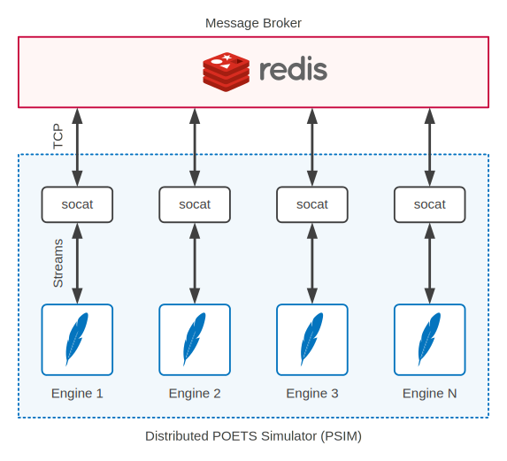

## POETS Simulator (`psim`)

### How it Works

At the top-level, `psim` is a Python tool that reads a POETS application (an
XML file) then generates and runs one or several instances of C++ simulation
engine. Each engine computes the states of a subset of application devices by
exchanging messages both internally and with other engines.

Messages and other information are exchanged between engines using a Redis
instance which must be setup and made accessible to `psim` on the host machine
(using the default Redis port 6379). Engines communicate by pushing
information on Redis queues dedicated to other engines.

Simulation engines do not communicate with the Redis server directly. Instead,
they read information from `stdin` and write to POSIX stream 3 (since `stdout`
and `stderr` are used for log/err outputs), which are then relayed to Redis
using `socat`. This setup has several advantages:

1. It simplifies engine implementation by avoiding socket programming, leaving
this chore to `socat`.

2. It decouples engine implementation from the choice of inter-engine
communication channels, permitting great flexibility in alternative engine
connection arrangements (e.g. multi-process pipelines, unix domain sockets).

3. It makes it easy to substitute simulation engines with functional
correspondents (e.g. other simulators or actual POETS hardware) in homogeneous
or heterogeneous arrangements.

The diagram below depicts this setup. Users don't need to worry about engine
instantiation and the use of `socat` -- this is all handled by `psim`
transparently to the user.

For quick and easy examples that show this setup at work see [Getting
Started](getting-started.md).
