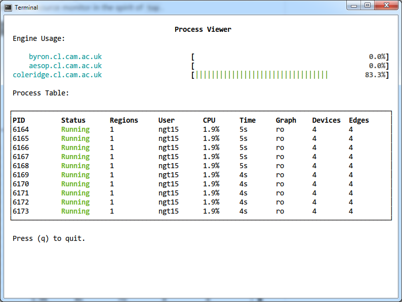

### Using `pcli`

`pcli` is a terminal that allows users to run distributed POETS applications
and manage a `pstack` deployment. This manual provides an overview of `pcli`
and some usage examples.

#### Usage

```
POETS Client (pcli) v0.1

Usage:
  pcli.py [options]

Options:
  -n --nocolor   Disable terminal colors.
  -q --quiet     Suppress printing banner.
```

#### The Basics

`pcli` is built on top of a Python interpreter; commands are implemented as
Python functions and are called using Python's syntax. All of Python, its
standard library modules and package ecosystem are available as well. For
example ...

```
$ pcli --quiet
pcli> [x**2 for x in range(10)]
[0, 1, 4, 9, 16, 25, 36, 49, 64, 81]
pcli> from datetime import datetime
pcli> datetime.now()
datetime.datetime(2018, 11, 26, 14, 21, 57, 46882)
pcli>
```

In other words, `pcli` is essentially the same as the off-the-shelve Python
interpreter available on most systems, but with some new functions imported.

To improve user experience, `pcli` features fish-like [autosuggestions](https://fishshell.com/docs/current/tutorial.html#tut_autosuggestions) and
[persistent context](http://docs.http-prompt.com/en/latest/user-guide.html#persistent-context). Variables of basic data types and command history are retained between
sessions.

#### Quick Start

You can run a simulation on `pcli` using the `run` command as follows:

```
pcli> run("tests/ring-oscillator-01.xml")
{'states': {u'n0': {u'state': 0, u'counter': 10, u'toggle_buffer_ptr': 0}, u'n1': {u'state': 0, u'counter': 10, u'toggle_buffer_ptr': 0}, u'n2': {u'state': 0, u'counter': 10, u'toggle_buffer_ptr': 0}, u'n3': {u'state': 0, u'counter': 10, u'toggle_buffer_ptr': 0}}, 'metrics': {u'Exit code': 0, u'Delivered messages': 40}}
```

(here loading one of the files from the repo's `test` directory)

Notice that the output is in the [machine-friendly format of
`psim`](psim.md#output-formats), specifically a JSON object containing
simulation metrics and final device states. The above is therefore very
similar to invoking `psim` (with the `--quiet` and `--result` switches) but
with the crucial difference that it's been executed by one of the engines
connected to the `pstack` deployment in use.

#### The Process Viewer

Before delving into more commands and  usage scenarios, it's probably a good
idea to introduce one of the main features of `pcli`, _the process viewer_, a
full-screen real-time process and resource monitor in the spirit of `top`.
Here's what it looks like ...

<p align="center">
	
</p>

This tool can be started by typing `top` in `pcli`. It shows available engines
(three in this case), their resource utilization plus a process table with
pending simulations (called _processes_ in `pstack`). Changes in the process
table or engine availability/utilization are updated in real-time.

(work in progress ...)
